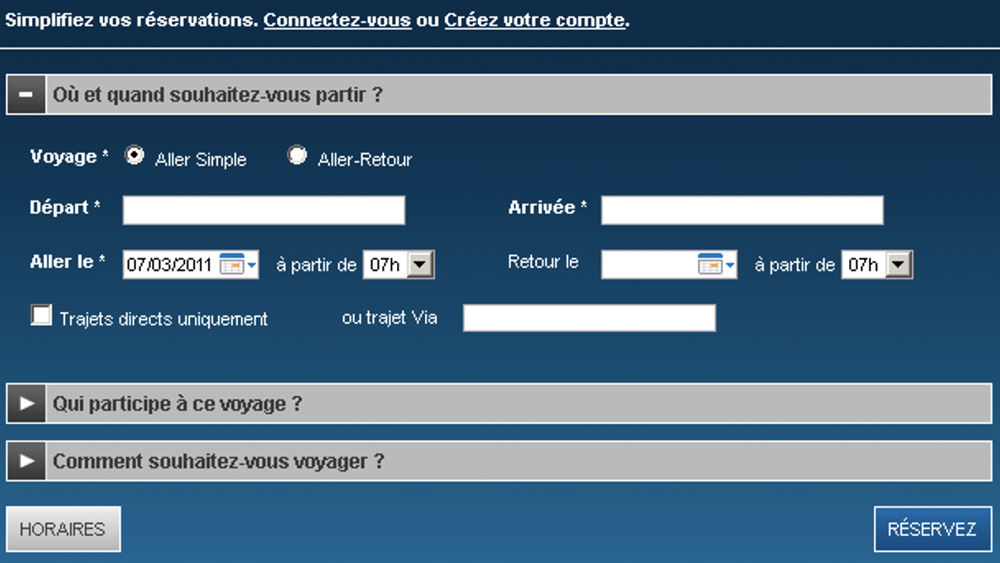

# voyageEnTrain

Durant les 6 séances restantes de TD/TP de la matière Méthodologie de Production d'Applications vous allez :
- utiliser Git (partage de code à plusieurs) - séance 1
- Planifier et suivre le développement d'un projet en méthode agile Scrum avec GitLab - séance 2
- Tester votre programme (tests unitraires et tests de couverture de code) - séances 3 et 4
- Utiliser des techniques d'intégration continue - séance 5
- Amélioration de la qualité de votre projet - séance 6

# Séance 1 : préparation du projet
Attention ! Si lors du cours vous avez déjà récupéré le projet de référence, le code de ce projet a pu être mis à jour entre temps. Dans ce cas replacez-vous sur votre machine dans le dossier du projet et faites un : git pull https://gitlab.com/BenOrcha/voyageentrain

## Répartition du travail

Créer des binômes. Les binômes seront conservés jusqu'à la fin des 6 séances.

## Installation d’un client git

Git est un logiciel de gestion de versions décentralisé : https://fr.wikipedia.org/wiki/Git

GitHub ou Gitlab (solutions hébergées basées sur git) permettent aux développeurs de stocker et de partager, publiquement ou non, le code qu’ils créent.

Dans la suite c'est Gitlab qui est utilisé.

Commencer par vous créer un compte sur gitlab : https://gitlab.com/

Mémoriser votre nom d'utilisateur et l'adresse mail que vous avez indiquée car vous en aurez besoin au paragraphe suivant.
 
Le principe de git est que chaque développeur a sur sa machine une copie du code présent sur le serveur Gitlab Pour ce faire, il faut disposer sur sa machine d’un client git. Git peut être installé sur Windows, Linux ou Mac. Si votre système d’exploitation est Linux ou apparenté (MacOS), git est en général installé par défaut. Pour le vérifier, ouvrez un terminal et tapez la commande git. Si git n’est pas installé suivez la procédure suivante :
- télécharger git: https://git-scm.com/downloads
- définir le user name : git config --global user.name "Mona Lisa" ou user.name est celui de gitlab
- définir l'adresse mail : git config --global user.email "email@example.com" ou user.email est celui de gitlab

Git est utilisable de deux façons :
-	Via une interface graphique
-	Via un terminal en ligne de commande

La deuxième façon est préférable car elle est absolument portable (vous pourrez utiliser les commandes git sur n’importe quel système). C’est cette façon qui est utilisée dans la suite de ce TP : c’est le mode Bash. Sous Windows, tapez git dans le menu démarrer et vous devriez pour choisir le mode bash. Sous Linux ou MacOS vous aurez accès à la commande git depuis tous les terminaux.

## Télécharger et tester le projet de référence
Tous les TP à suivre sont basés sur un projet de référence: https://gitlab.com/BenOrcha/voyageentrain

Ce projet utilise la version 11 de Java JDK.

Commencer par vérifier quelle est la version de Java sur votre machine. Dans une fenêtre de commande utilisez la commande : java -version

Si besoin, installez sur votre machine Java JDK 11 : https://www.oracle.com/java/technologies/javase-jdk11-downloads.html

Placez-vous alors dans un dossier où vous voulez placer le projet et récupérez-le via la commande : 

git clone https://gitlab.com/BenOrcha/voyageentrain

Cette commande va créer un dossier contenant le projet sur votre machine. Déplacez vous dans ce dossier avant d'utiliser les autres commandes git.
 
Démarrer une version récente d'Eclipse puis importez-y le projet : Import -> Gradle -> Existing Gradle project 

## Uploader le projet de référence vers votre projet Gitlab
A présent vous dévez uploader ce projet vers votre compte gitlab afin de pouvoir le modifier de votre côté. Pour cela utilisez la commande :

git push --set-upstream https://gitlab.com/BenOrcha/nouveau

où BenOrcha est l'url de votre compte gitlab et nouveau est le nom du projet que vous voulez créer dans gitlab. 

## Permettre à des collaborateurs d'accéder à votre projet
A présent vous devez ajouter votre binôme dans le projet gitlab ainsi que le professeur qui vous suit.
Pour cela accéder à menu members dans gitlab et ajouter votre binôme en tant que Maintainer (role permission) et votre professeur en tant que reporter.

Pour que votre enseignant puisse facilement vous associer à votre projet merci de renseigner dans ces documents l'adresse de votre projet gitlab (chaque étudiant de chaque binôme indique l'adresse du projet commun au binôme) : 
- groupe jaune : https://drive.google.com/file/d/1CjePfD1pQh7Aubo-PBU6_ObIVDN7-ygH/view?usp=sharing
- groupoe vert : https://drive.google.com/file/d/1SdFMUew2HAnq4Q52mDUxwiuN85KWAJuy/view?usp=sharing
- groupe bleu : https://drive.google.com/file/d/1SBcued4m-wlt7U5IszTWkXWxIHcsMhql/view?usp=sharing
- groupe rouge : https://drive.google.com/file/d/1KayPdlAo79KPXDPkpQCVfv6xnxDa1pWv/view?usp=sharing
- groupe orange : https://drive.google.com/file/d/1wXdon2_kqqfchqiB5l6jfwEqAOitnlTA/view?usp=sharing

## Utiliser git
Dans la suite de ce TP vous allez utiliser git. Vous avez à votre disposition (voir plus bas) un memento des commandes git.

### Travailler sur la branche principale

Créer, sous Eclipse dans le dossier src/main/java/transport/voyageEnTrain, un fichier appelé Personne.java.

Ajoutez-y une classe Personne.

Comment indiquer à git de prendre en compte ce fichier ?

Éditer ce fichier à nouveau (ajoutez par exemple une méthode à la classe).

Comment indiquer à git de conserve les différentes versions de vos fichiers ?

Comment renvoyer vers le serveur git votre fichier ?

Créer à présent un nouveau dossier dans le dossier doc du projet et ajoutez-y un fichier.

Comment indiquer à git de prendre en compte le contenu de ce dossier ?

### Créer des branches
Il est plus judicieux si on travaille à plusieurs sur le même projet que chaque développeur travaille sur une fonctionnalité du projet. Dans ce cas, git préconise d’utiliser des branches.

Comment créer une branche dans votre dossier local de projet ?

Comment lister les branches sur votre machine ?

Comment se déplacer sur la nouvelle branche ?

Que contient cette branche ?

Ajoutez-y des fichiers et éditer les (voir la question précédente). N’oubliez pas de faire des commit pour créer des versions de vos fichiers.

Comment poussez cette nouvelle branche vers le dépôt github distant ?

Revenez à présent sur la branche principale (elle s’appelle master ou main). Que contient-elle ?

Comment fusionner la branche sur vous avez créé avec la branche principale ?

### Gérer des conflits

Créez une nouvelle branche et déplacez-vous dessus.

Mais cette fois éditer des fichiers existants dans cette branche.

Revenez vers la branche principale (sans avoir oublié de faire des commit au préalable) et tentez de fusionner les branches. Que constatez-vous ?

Ouvrez les fichiers en cause et voyez comment git a conservé les deux versions de vos fichiers. Choisissez quelle version vous voulez conserver. Faites un commit et tentez à nouveau la fusion (ça devrait marcher !).

### Mémento git

git clone https://github.com/charroux/jee	Télécharge le projet donné en adresse dans un nouveau dossier portant le nom du projet

git add contenu	Ajoute au dépôt local git le contenu du dossier et du fichier précisé en argument

git commit -a -m "commentaire"	Créé un nouvelle version de votre dépôt local git

git push adresse-https-du-projet	Renvoi vers github votre projet

git push adresse-https-du-projet brancheLocale:brancheDistante	Renvoi la branche locale de votre projet vers la branche distante sur github

git branch 	Liste les branches sur votre machine

git branch nomBranche	Créé une branche de nom nomBranche

git checkout nomBranche	Se déplace vers la branche de nom nomBranche

git merge nomBranche		Fusionne la branche nomBranche avec la branche sur laquelle on est

# Séance 2 : Planification de projets avec la méthode agile SCRUM

Soit la copie d’écran d’une maquette d’une application de réservation de billets de train.

## Question 1 : constitution du backlog du produit.
Déduire de l'interfaceles ci-dessus les fonctionnalités essentielles à développer. Consignez chaque fonctionnalité sous la forme d'une User Story. Pour vous aider, une première User Story a été créée dans le projet de référence : https://gitlab.com/BenOrcha/voyageentrain/-/issues/1 (dans gitlab les User Stories sont appelées des Issues).

On peut voir la liste des User Stories : https://gitlab.com/BenOrcha/voyageentrain/-/issues

Dans cette liste il y a 1 user story et 2 issues, mais pour l'instant on ne s'occupe pas des deux issues.

## Question 2 : constitution du backlog ordonnés
Classez, en justifiant vos choix, les éléments du backlog du produit selon l’ordre dans lequel ils vont être développés.

La vue board des issues de gitlab vous permet de classer les user stories : https://gitlab.com/BenOrcha/voyageentrain/-/boards

Justifiez vos choix dans la page d'accueil de votre projet (le fchier ReadMe présent à la racinne du projet). Attention ! Si vous éditez le fichier ReadMe directement dans gitlab, vous ne pourrez plus faire de push sans avoir fait un pull au préalable (en effet le fichier ReadMe sur gitlab sera plus récent que celui sur votre machine et git vous demanderra de télécharger via un pull la dernière version). Pour éviter cela vous pouvez éditer le fichier ReadMe dans Eclipse (placez-vous dans l'onglet Mardown source plutôt de Preview de l'éditeur), faire un git commit et un git push pour uploader le fichier ReadMe vers gitlab.u

## Question 3 : estimation du backlog du produit.
En prenant comme référence une des stories, estimer le poids de chaque story du backlog.

La poids d'une story dans la méthode agile Scrum mesure le degré de difficulté de réalisation de la story. C'est un nombre sans unité sur une échelle ouverte. Ce qui compte au final c'est le poids relatif des stories entre-elles. Ainsi une story qui pèse 20 et deux fois plus compliquée à réaliser d'une story qui pèse 10.

Dans gitlab, le poids apparaît dans la liste des issues (5 ici) : https://gitlab.com/BenOrcha/voyageentrain/-/issues

Vous pouvez changer ce poids en éditant la story. 

## Question 4 : estimation de la date de terminaison du projet
On suppose que le développement est confié à une équipe de 4 d’étudiants de DUT d’informatique 2ième année en stage, et que les technologies utilisées sont des technologies enseignées telles que PHP.

De plus on fixe la durée d’un sprint à 1 mois (un sprint est un mini projet pour la méthode Scrum et le projet complet est découpé en sprints).

Dans gitlab, les fins des sprints sont matérialisées par des millestones. Dans le projet de référence, deux millestones ont été créés : https://gitlab.com/BenOrcha/voyageentrain/-/milestones

Vous pouvez voir que la user story 1 a été affectée au millestone Sprint 1. Crééez ainsi vos millestones dans votre projet./.

Donnez une estimation de la durée du projet prévue. Pour cela : 

- calculer la somme des poids des user stories
- estimez la capacité initiale de votre équipe (le nombre de poids que vous vous sentez capable en tant qu'équipe de réaliser pendant 1 sprint (1 mois ici)))
- diviser le poids total des user stories par la capacité et vous obtennez ainsi un nombre de sprints que vous pouvez convertir en mois (facile non ?)

Détailler tous vos calculs dans la page ReadMe de votre projet. 

## Question 5 : planification d’un sprint
Au début de chaque sprint a lieu une réunion de planification du sprint. Le but est de découper les users stories qui doivent être réalisées durant le sprint en tâches, puis l’équipe de projet se répartie les tâches entre ses membres.

Dans le projet de référence (https://gitlab.com/BenOrcha/voyageentrain/-/issues), il y a deux issues ("Concevoir l'interface les tables de la base de données" et "Concevoir l'interface utilisateur") qui sont en fait des tâches à réaliser pour la user story "En tant qu’utilisateur non inscrit je veux créer un compte afin de réserver des places de train pour un voyage et de faciliter mes réservations futures". Pour gitlab tout est des issues (il y a aussi le notion d'incident mais ça corespond à la notion de bug). Pour associer des tâches à une user story on peut leuf affecter le même label (le label rouge "user story 1" ici).

Décomposer en tâches la première user story à réaliser dans votre projet.

# Séance 3 : spécifier les cas de tests fonctionnel
Attention ! Si lors des séances précédentes vous avez déjà récupéré le projet de référence, le code de ce projet a pu être mis à jour entre temps. Dans ce cas replacez-vous sur votre machine dans le dossier du projet et faites un : git pull https://gitlab.com/BenOrcha/voyageentrain

Dans la suite on se focalise sur la User Story : En tant qu’utilisateur, je veux choisir les dates ainsi que les lieux de départ et d’arrivée de mon voyage afin de déterminer une liste de train qui respectent au mieux mes choix.

Une matrice de tests permet de définir les cas de tests qui permettent de tester un logiciel. L'ébauche de la matrice de test est donnée ici : https://docs.google.com/spreadsheets/d/1oZHWEpirgwBhf3sFZpBLWzmgP4-DnTmQBHrMc8RlI7Q/edit?usp=sharing

Une matrice de tests contient, dans ses lignes des conditions sur les entrées du logiciel. Dans notre cas, la fonction qui implémente la user story est la fonction suivante:

    /**
     * Retourne la liste des trains ayant pour ville de départ nomVilleDeDepart, 
     * pour ville d'arrivée nomVilleArrivee, 
     * et qui partent après la date dateDeDepart
     * @param nomVilleDeDepart
     * @param nomVilleArrivee
     * @param dateDeDepart au format hh:mm jj/mm/aaaa, exemple: "23:59 01/01/2021")
     * @return
     */
    public ArrayList<Train> chercherTrain(String nomVilleDeDepart, String nomVilleArrivee, String dateDeDepart){
    	return null;
    }
    
Cet fonction est définie dans le fichier : https://gitlab.com/BenOrcha/voyageentrain/-/blob/master/src/main/java/transport/voyageEnTrain/Trains.java

Cette fonctions comportent trois entrées :   
- la ville de départ
- la ville d'arrivée
- la date de départ

Les conditions sur les entrées sont :
- Ville départ différente ville arrivée
- Ville de départ élément des villes de départ
- Ville d'arrivée élément des villes d'arrivée
- Il existe un trajet entre les villes de départ et d'arrivée
- La date de départ est inférieure à une des dates de la ville de départ

La matrice a été initialisée avec les valeurs :
- la ville de départ : ici c'est Paris
- la ville d'arrivée : Marseille
- la dae de départ : 23:59 01/01/2021

Ces valeurs sont tirées du constructeur de la classe Trains :
    	
    	public Trains(){
        gares.add("Ici c'est Paris");
        gares.add("Marseille");
        gares.add("Lille");
        gares.add("Lyon");
        
        try {
			Train train = new Train(1, gares.get(0), gares.get(1), "23:59 01/01/2021", "10:18 02/01/2021");
			trains.add(train);

On voit dans la matrice que toutes les conditions sur les entrées sont à vrai, montrant dans ce cas, qu'un train existe pour les entrées choisies, le train numéro 1.

Afin de trouver tous les autres cas de tests il faut considérer toutes les combinaisons possibles de vrai/faux dans la matrice de test.
 
## Question
Ajoutez à la matrice de tests des nouvelles colonnes où chaque colonne contient un cas de test, jusqu'à ce que toutes les combinaisons possibles de vrai/faux ont été trouvées.

## Evaluation de votre travail
Ajoutez votre matrice de tests à la page d'accueil ReadMe de votre projet gitlab.

# Séance 4 : développement guidé par les tests
Attention ! Si lors du cours vous avez déjà récupéré le projet de référence, le code de ce projet a pu être mis à jour entre temps. Dans ce cas replacez-vous sur votre machine dans le dossier du projet et faites un : git pull https://gitlab.com/BenOrcha/voyageentrain

Votre projet contient déjà une classe de tests : https://gitlab.com/BenOrcha/voyageentrain/-/blob/master/src/test/java/transport/voyageEnTrain/VoyageEnTrainApplicationTests.java

Ce sont des tests unitaires à la norme JUnit.

## Lancer le programme de test

### En ligne de commande

Ouvrez un terminal (un fenêtre de commande sous Windows) dans le dossier du projet (là où est le fichier gradlew) et tapez la commande :

- sous Windows : gradlew build
- sous Linux : ./gradlew build

Un rapport de test a été généré dans le dossier build/reports/tests/test/index.html 

### via Eclipse

Faites un clic droit sur votre projet dans Elipse, puis Run as -> JUnit test. Vous pouvez à présent consulter le rapport de test dans Eclipse.

## Question 1 : tests unitaires avec JUnit

Complélter la classe de test avec les tests que vous avez définis dans la matrice de tests de la séance 4, puis implémenter la user story "En tant qu’utilisateur, je veux choisir les dates ainsi que les lieux de départ et d’arrivée de mon voyage afin de déterminer une liste de train qui respectent au mieux mes choix" dans la fonction :

    /**
     * Retourne la liste des trains ayant pour ville de départ nomVilleDeDepart, 
     * pour ville d'arrivée nomVilleArrivee, 
     * et qui partent après la date dateDeDepart
     * @param nomVilleDeDepart
     * @param nomVilleArrivee
     * @param dateDeDepart au format hh:mm jj/mm/aaaa, exemple: "23:59 01/01/2021")
     * @return
     */
    public ArrayList<Train> chercherTrain(String nomVilleDeDepart, String nomVilleArrivee, String dateDeDepart){
    	return null;
    }

de la classe : https://gitlab.com/BenOrcha/voyageentrain/-/blob/master/src/main/java/transport/voyageEnTrain/Trains.java

## Question 2 : couverture de code

Votre code est composée d'intructions et il est important que toutes les instructions soient testées. On parle ici de couverture de code. 

### Lancer les tests de couverture de code en ligne de commande

Ouvrez un terminal (un fenêtre de commande sous Windows) dans le dossier du projet (là où est le fichier gradlew) et tapez la commande :

- sous Windows : gradlew build jacocoTestReport
- sous Linux : ./gradlew build jacocoTestReport

Un rapport de test a été généré dans le dossier build/reports/jacoco/test/html/index.html 

vous verrez que Jacoco a colorié votre code :
- en vert si votre programme de test a permit de tester une instruction
- en rouge dans le cas contraire

### Lancer les tests de couverture de code via Eclipse

Pour déclencher le test de couverure de code, faites un clic droit sur votre projet dans Eclipse puis, Coverage as -> JUnit test. Afficher ensuite votre classe Trains et vous verrez que Eclipse a colorié votre code :
- en vert si votre programme de test a permit de tester une instruction
- en rouge dans le cas contraire

### Garantir la couveture de code

Ajouter des nouvelles méthodes à votre classe de test tant que toutes les instructions de la fonction suivante n'ont pas été couvertes :

    /**
     * Retourne la liste des trains ayant pour ville de départ nomVilleDeDepart, 
     * pour ville d'arrivée nomVilleArrivee, 
     * et qui partent après la date dateDeDepart
     * @param nomVilleDeDepart
     * @param nomVilleArrivee
     * @param dateDeDepart au format hh:mm jj/mm/aaaa, exemple: "23:59 01/01/2021")
     * @return
     */
    public ArrayList<Train> chercherTrain(String nomVilleDeDepart, String nomVilleArrivee, String dateDeDepart){
    	return null;
    }
# Séance 5 : livraison continu

# Séance 6 : qualité logiciel